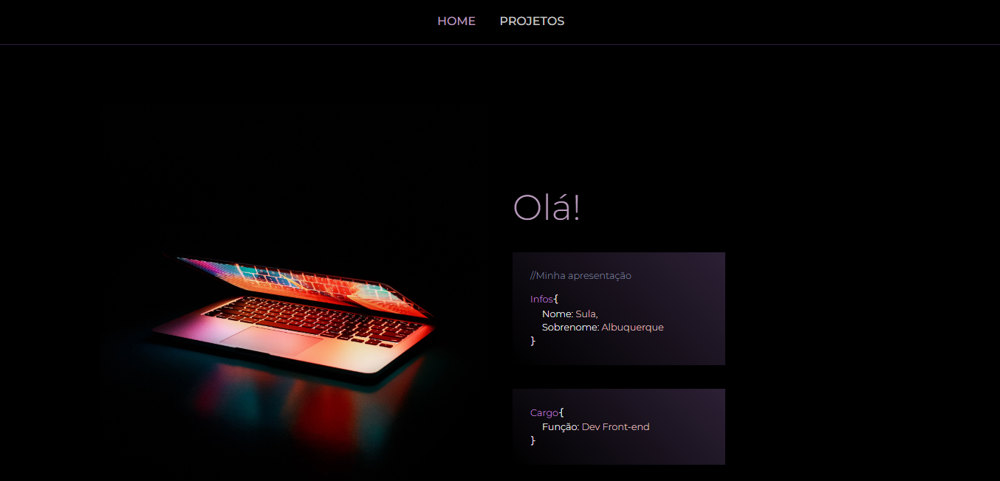
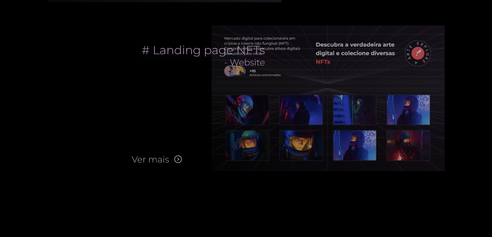
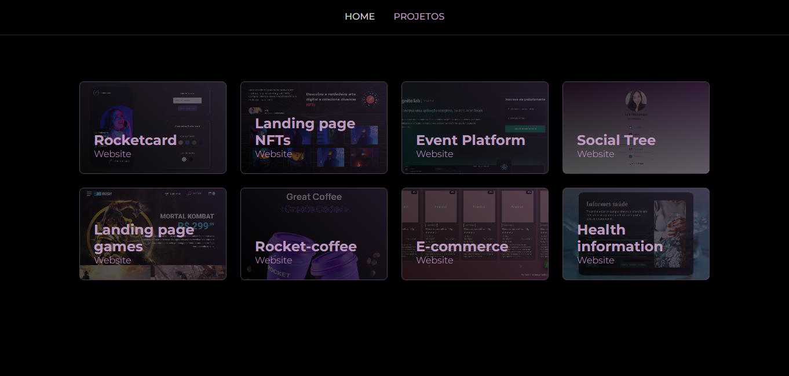

<h1 align="center">Portfólio</h1>

<h1 align="center">

</h1>

<h4 align="center">
    Acesse a aplicação online pelo 
    <a href="https://portfolio-sulaalbuquerque.vercel.app">link</a>.
<h4>

##  Sobre

O projeto em apresentação se trata do meu portfólio de apresentação como dev front-end. Nele se faz presente seção de apresentação, conhecimentos, últimos projetos e contato.

Meu portfólio foi construído tendo como base e inspiração o projeto desenvolvido pelo Gabriel Borges (https://github.com/GBDev13).
O desenvolvimento foi feito utilizando Prismic como CMS e envio de e-mail com Nodemailer, além das tecnologias citadas na seção abaixo.

Destaque como primeiro desenvolvimento em que pude ver na prática como NextJs é integrado à um projeto, assim como a utilização do Prismic e Nodemailer.

---

## Tecnologias usadas

O projeto foi desenvolvido utilizando as seguintes tecnologias:

- HTML5;
- CSS;
- JavaScript;
- ReactJs / Styled-component;
- NextJs;
- TypeScript;
- VS Code.

---

## Acesso ao projeto
    - git clone <link-repositório> - (clone do repositório)
    - cd <diretório> - (acesso ao diretório)
    - npm install - (instalação das dependências)
    - npm start - (execução do projeto)
   
---
